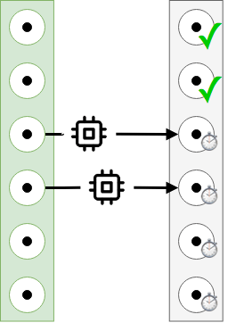
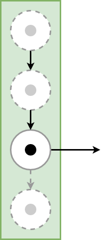

.. image:: https://badge.fury.io/py/SeqTools.svg
   :target: https://github.com/nlgranger/SeqTools
   :alt: PyPi package
.. image:: https://circleci.com/gh/nlgranger/SeqTools.svg?style=shield
   :target: https://circleci.com/gh/nlgranger/SeqTools
   :alt: CircleCI Continuous integration
.. image:: https://readthedocs.org/projects/seqtools-doc/badge
   :target: http://seqtools-doc.readthedocs.io
   :alt: Documentation
.. image:: https://api.codacy.com/project/badge/Grade/f5324dc1e36d46f7ae1cabaaf6bce263
   :target: https://www.codacy.com/app/nlgranger/SeqTools?utm_source=github.com&utm_medium=referral&utm_content=nlgranger/SeqTools&utm_campaign=Badge_Grade
   :alt: Code quality analysis
.. image:: https://codecov.io/gh/nlgranger/SeqTools/branch/master/graph/badge.svg
   :target: https://codecov.io/gh/nlgranger/SeqTools
   :alt: Tests coverage
.. image:: http://joss.theoj.org/papers/527a3c6e78ef0b31f93bbd29235d5a0b/status.svg
   :target: http://joss.theoj.org/papers/527a3c6e78ef0b31f93bbd29235d5a0b
   :alt: Citable paper

SeqTools
========

SeqTools extends the functionalities of itertools to indexable (list-like)
objects. Some of the provided functionalities include: element-wise function
mapping, reordering, reindexing, concatenation, joining, slicing, minibatching,
`etc <https://seqtools-doc.readthedocs.io/en/stable/reference.html>`_.

SeqTools functions implement **on-demand evaluation** under the hood:
operations and transformations are only applied to individual items when they
are actually accessed. A simple but powerful prefetch function is also provided
to quickly evaluate elements.

SeqTools originally targets data science, more precisely the data preprocessing
stages. Being aware of the experimental nature of this usage,
on-demand execution is made as transparent as possible by providing
**fault-tolerant functions and insightful error message**.

Example
-------

Example
-------

>>> def f1(x):
...     return x + 1
...
>>> def f2(x):  # slow and memory heavy transformation
...     time.sleep(.01)
...     return [x for _ in range(500)]
...
>>> def f3(x):
...     return sum(x) / len(x)
...
>>> data = list(range(1000))

Without seqtools, defining the pipeline and reading values looks like
so:

>>> tmp1 = [f1(x) for x in data]
>>> tmp2 = [f2(x) for x in tmp1]  # takes 10 seconds and a lot of memory
>>> res = [f3(x) for x in tmp2]
>>> print(res[2])
3.0
>>> print(max(tmp2[2]))  # requires to store 499 500 useless values along
3

With seqtools:

>>> tmp1 = seqtools.smap(f1, data)
>>> tmp2 = seqtools.smap(f2, tmp1)
>>> res = seqtools.smap(f3, tmp2)  # no computations so far
>>> print(res[2])  # takes 0.01 seconds
3.0
>>> print(max(tmp2[2]))  # easy access to intermediate results
3

Batteries included!
-------------------

The library comes with a set of functions to manipulate sequences:

.. |concatenate| image:: docs/_static/concatenate.png

.. _concatenation: https://seqtools-doc.readthedocs.io/en/latest/reference.html#seqtools.concatenate

.. |batch| image:: docs/_static/batch.png

.. _batching: https://seqtools-doc.readthedocs.io/en/latest/reference.html#seqtools.batch

.. |gather| image:: docs/_static/gather.png

.. _reindexing: https://seqtools-doc.readthedocs.io/en/latest/reference.html#seqtools.gather

.. _prefetching: https://seqtools-doc.readthedocs.io/en/latest/reference.html#seqtools.prefetch

.. |interleaving| image:: docs/_static/interleaving.png

.. _interleaving: https://seqtools-doc.readthedocs.io/en/latest/reference.html#seqtools.interleave

.. _uniter: https://seqtools-doc.readthedocs.io/en/latest/reference.html#seqtools.uniter

==================== ================= ===============
| `concatenation`_   | `batching`_     | `reindexing`_
| |concatenate|      | |batch|         | |gather|
| `prefetching`_     | `interleaving`_ | `uniter`_
| |prefetch|         | |interleaving|  | |uniter|
==================== ================= ===============

and others (suggestions are also welcome).

Installation
------------

.. code-block:: bash

   pip install seqtools

Documentation
-------------

The documentation is hosted at `https://seqtools-doc.readthedocs.io
<https://seqtools-doc.readthedocs.io>`_.

Contributing and Support
------------------------

Use the `issue tracker <https://github.com/nlgranger/SeqTools/issues>`_
to request features, propose improvements or report issues. For questions
regarding usage, please send an `email
<mailto:3764009+nlgranger@users.noreply.github.com>`_.

Related libraries
-----------------

`Joblib <https://joblib.readthedocs.io>`_, proposes low-level functions with
many optimization settings to optimize pipelined transformations. This library
notably provides advanced caching mechanisms which are not the primary concern
of SeqTool. SeqTool uses a simpler container-oriented interface with multiple
utility functions in order to assist fast prototyping. On-demand evaluation is
its default behaviour and applies at all layers of a transformation pipeline. In
particular, parallel evaluation can be inserted in the middle of the
transformation pipeline and won't block the execution to wait for the
computation of all elements from the dataset.

SeqTools is conceived to connect nicely to the data loading pipeline of Machine
Learning libraries such as PyTorch's `torch.utils.data
<http://pytorch.org/docs/master/data.html>`_ and `torchvision.transforms
<http://pytorch.org/docs/master/torchvision/transforms.html>`_ or Tensorflow's
`tf.data <https://www.tensorflow.org/guide/datasets>`_. The interface of these
libraries focuses on `iterators
<https://docs.python.org/3/library/stdtypes.html#iterator-types>`_ to access
transformed elements, contrary to SeqTools which also provides arbitrary reads
via indexing.