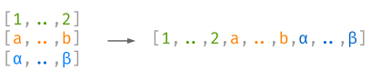
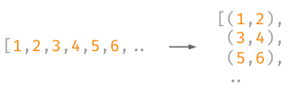
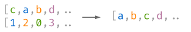

SeqTools
========

.. toctree::
   :hidden:
   :includehidden:
   :maxdepth: 2

   self
   installation
   tutorial
   reference
   examples

.. testsetup::

   import time

   with open("a.txt", "w") as f:
      pass
   with open("b.txt", "w") as f:
      f.write("a")
   with open("c.txt", "w") as f:
      f.write("a\nb\nc")
   with open("d.txt", "w") as f:
      pass

.. testcleanup::

   import os

   os.remove("a.txt")
   os.remove("b.txt")
   os.remove("c.txt")
   os.remove("d.txt")

SeqTools extends the functionalities of itertools to indexable (list-like)
objects. Some of the provided functionalities include: element-wise function
mapping, reordering, reindexing, concatenation, joining, slicing, minibatching,
`etc <API Reference>`_.

SeqTools functions implement **on-demand evaluation** under the hood:
operations and transformations are only applied to individual items when they
are actually accessed. A simple but powerful prefetch function is also provided
to eagerly evaluate elements in background threads or processes.

SeqTools originally targets data science, more precisely the data preprocessing
stages. Being aware of the experimental nature of this usage,
on-demand execution is made as transparent as possible by providing
**fault-tolerant functions and insightful error message**.

Example
-------

Successively map three functions on a list of values:

>>> def count_lines(filename):
...     with open(filename) as f:
...         return len(f.readlines())
...
>>> def remove_extension(filename):
...     return filename.removesuffix(".txt")
...
>>> filenames = ["a.txt", "b.txt", "c.txt", "d.txt"]

>>> linecounts = [count_lines(f) for f in filenames]  # waste of time reading all files
>>> labels = [remove_extension(f) for f in filenames]
>>> out = [(l, c) for l, c in zip(labels, linecounts)]
>>>
>>> linecounts[2]
3
>>> out[1]
('b', 1)

With seqtools:

>>> linecounts = seqtools.smap(count_lines, filenames)
>>> labels = seqtools.smap(remove_extension, filenames)
>>> out = seqtools.collate([labels, linecounts])  # no computations so far
>>>
>>> linecounts[2]                                 # only evaluates count_lines on index 2
3
>>> out[1]
('b', 1)

Batteries included!
-------------------

The library comes with a set of functions to manipulate sequences:

.. _concatenation: reference.html#seqtools.concatenate

.. _batching: reference.html#seqtools.batch

.. _reindexing: reference.html#seqtools.gather

.. |prefetch| image:: _static/prefetch.svg

.. _prefetching: reference.html#seqtools.prefetch

.. |interleave| image:: _static/interleave.svg

.. _interleave: reference.html#seqtools.interleave

.. |uniter| image:: _static/uniter.svg

.. _uniter: reference.html#seqtools.uniter

+-------------------+---------------+
| `concatenation`_  | |concatenate| |
+-------------------+---------------+
| `prefetching`_    | |prefetch|    |
+-------------------+---------------+
| `batching`_       | |batch|       |
+-------------------+---------------+
| `interleave`_     | |interleave|  |
+-------------------+---------------+
| `reindexing`_     | |gather|      |
+-------------------+---------------+
| `uniter`_         | |uniter|      |
+-------------------+---------------+

and others (suggestions are also welcome).
